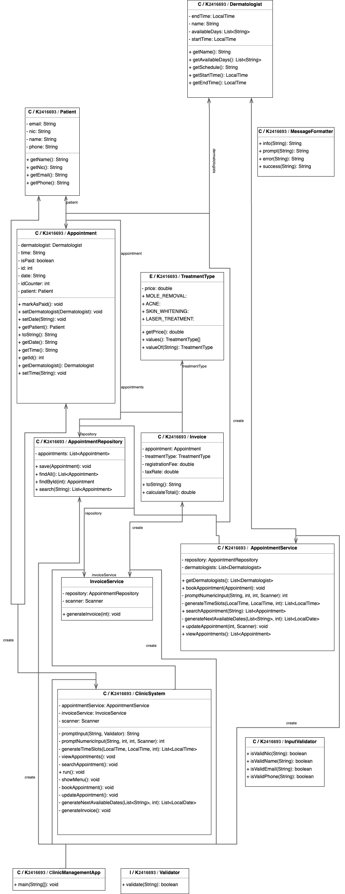

# Class Diagram

[//]: # (# Book Appointments)

[//]: # (![create-Appointment]&#40;./src/assets/booking.png&#41;)

[//]: # (![app-recipt]&#40;./src/assets/appo-recipt.png&#41;)

[//]: # ()
[//]: # ()
[//]: # (# View Appointments)

[//]: # (![view-Appointment]&#40;./src/assets/view.png&#41;)

[//]: # ()
[//]: # ()
[//]: # (# Search Appointments)

[//]: # (![search-Appointment]&#40;./src/assets/search.png&#41;)

[//]: # ()
[//]: # ()
[//]: # (# Update Appointments)

[//]: # (![update-Appointment]&#40;./src/assets/update.png&#41;)

[//]: # ()
[//]: # ()
[//]: # (# Invoice Appointments)

[//]: # (![create-Appointment]&#40;./src/assets/invoice.png&#41;)

# Esoft Id - E222318

